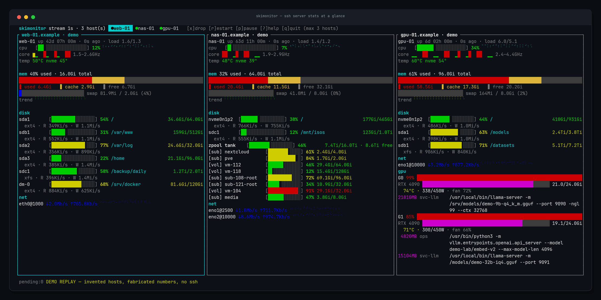

# skimonitor

**One terminal. Three servers. Everything at a glance.**

skimonitor is a multi-host SSH monitoring TUI written in Rust. Point it at your machines and it streams a single dense dashboard — CPU, memory, disks (including ZFS truth), network, temperatures, and GPUs with per-process VRAM — side by side, refreshed every second. No agents, no daemon, no database: just SSH keys and one static binary.



*(The screenshot above is `--demo` mode: three invented hosts replayed through the exact same render pipeline as live data — nothing here comes from a real machine.)*

## Why

Most fleet monitors want you to install a collector on every box, run a server, and open ports. skimonitor wants one thing: that you can already `ssh` to the host. It runs a small self-contained probe over a persistent SSH connection, streams one JSON frame per second back, and renders three hosts on one screen at terminal size. It is the tool you start when `htop` on five tabs and `watch -n1 df` on three terminals stop being manageable — but a full observability stack is overkill.

## Features

- **Zero install on targets** — the probe is embedded in the binary and shipped over SSH; the target only needs `bash` + coreutils (no jq, no python, no root except for ZFS pool stats).
- **True rates, honestly computed** — CPU %, disk R/W, and net ↓↑ are derived by diffing cumulative counters between consecutive frames, so nothing is sampled-and-hoped.
- **GPU visibility that actually helps** — utilization, VRAM (proportional bar + live trend sparkline), temp/power/fan, and every compute process with its **full command line** (read from `/proc/<pid>/cmdline`, not nvidia-smi's truncated name) and per-process VRAM. Driver-less hosts (e.g. Proxmox with cards passed through to VMs) still list GPUs via PCI sysfs presence.
- **ZFS truth, not `df` lies** — pool rows use real device usage (`zpool list -p`), and each dataset with its own limit (quota / refquota / volsize — what Proxmox actually enforces on subvols and VM disks) gets its own row against that limit.
- **Per-core load with topology** — one block per logical CPU, hyperthread siblings glued together, physical cores spaced, frequency range on the right.
- **Nothing silently truncated** — cards scroll (keys or mouse wheel); a GPU process with a 300-character command line is wrapped and shown in full. The title bar tells you exactly which lines you're looking at (`↕7-42/58`).
- **Self-healing streams** — dead SSH connections are detected, respawned with capped exponential backoff, and a silence watchdog reconnects streams that stop answering. Auth failures as your user automatically retry as `root@host`.
- **`--demo` mode** — three invented hosts replayed through the real code path, for screenshots, testing, and showing your team what the tool does. No SSH, no data, no risk.

## Install

Grab the latest release binary for your platform:

```
https://github.com/abdulazizalmalki-gh/skimonitor/releases
```

Or build from source (Rust stable, no other toolchain dependencies):

```
cargo build --release        # -> target/release/skimonitor
```

## Quick start

```
skimonitor web-01 db-01 cache-02        # three hosts, 1 Hz
skimonitor local                        # watch this machine
skimonitor -i 2 user@203.0.113.9        # 2-second frames over WAN
```

Every argument is a target: an `~/.ssh/config` alias, a hostname, an IP, or `user@host`. `local` self-scans without SSH. Max 3 hosts side by side; press `x` to drop one, `a` to add another.

Want to see it before wiring it to anything?

```
skimonitor --demo
```

## Authentication

skimonitor shells out to your system `ssh` client, so it uses exactly the keys that already live on the machine running it: `ssh-agent`, `~/.ssh/config` (aliases, `IdentityFile`), and every private key found in `~/.ssh` — including non-default filenames, which plain `ssh` would never offer. `BatchMode=yes` + publickey-only means it can never hang waiting for a password nobody typed.

Nothing is stored by skimonitor or sent anywhere except the hosts you target. One honest exception, inherited from standard ssh: first-seen host keys are accepted and written to your `~/.ssh/known_hosts` (`accept-new`). skimonitor is also not an ssh sandbox — your own `~/.ssh/config` behavior (proxies, forwarding) applies. If a host refuses your user and you didn't pin one, skimonitor retries once as `root@host` and labels the card `ssh:root`.

## Keys

| key | action |
|-----|--------|
| `a` / `x` | add / remove host |
| `1..3`, `←`/`→`, `Tab` | select host |
| `↑`/`↓`, `PgUp`/`PgDn`, `Home`/`End` | scroll the focused card when it overflows (`↕` shown in its title) |
| mouse wheel | scroll the card under the cursor |
| `+` / `-` | stream interval, 1..60 s |
| `r` | restart all streams |
| `p` | pause (tears down the SSH sessions) / resume |
| `?` / `q` | help / quit |

## `--once`: scripted snapshots

```
skimonitor --once local web-01 db-01
```

Probes each target once, prints a one-line summary per host, exits 1 if any failed — handy in cron alerts and deploy scripts.

## What's collected per frame

Load average, overall + per-core CPU % and MHz, CPU/NVME temperatures and sensors, RAM (used / cache / free, swap, live trend sparkline), per-mount disk usage with read/write throughput, NIC rx/tx with sparkline and link speed, and GPUs: utilization, VRAM, temp, power/cap, fan, plus compute processes with full argv and per-process VRAM.

On ZFS hosts the disk section switches to pool + dataset truth (see Features). On Proxmox, VM disks (zvols) and LXC roots (subvols) are shown against the quotas Proxmox actually enforces — not the pool-wide mount numbers `df` reports for every dataset identically.

## How it works

```
┌ your laptop ──────┐        ┌ target host ────────────┐
│ skimonitor (TUI)  │  ssh   │ bash -s << embedded     │
│ rates = diff of   │◄───────│ probe.sh                │
│ two frames @1 Hz  │ stdout │ → 1 JSON line / tick    │
└───────────────────┘        └─────────────────────────┘
```

One persistent `ssh -T` per host runs the embedded probe (`probe.sh`, bash + coreutils only) in a loop; each tick prints exactly one JSON object. The Rust side parses frames, diffs consecutive counters into rates, and renders with ratatui. There is no state between frames beyond rolling sparkline history, so a dropped connection costs one tick — and supervision reconnects automatically.

## Repository layout

```
probe.sh        the remote probe (embedded via include_str!)
src/main.rs     app state, stream supervision, input
src/model.rs    probe JSON schema + frame-diff metrics
src/ui.rs       card rendering, scrolling, layout
src/widgets.rs  gauges, heat colors, braille sparklines
src/demo.rs     --demo synthetic hosts (same pipeline as live)
src/ssh.rs      ssh invocation, stream reader
dev/build.sh    release build with local paths remapped
dev/capture_tui.py + dev/render_shot.py   screenshot pipeline for docs/
```

## Privacy

skimonitor reads what a shell session could already read on a host you can SSH to, keeps it in RAM for the lifetime of the terminal, and never writes metrics anywhere. No telemetry, no updates, no network calls except the SSH connections you asked for (host-key acceptance to `known_hosts` is standard ssh behavior and the only local write). Note: GPU process command lines are shown verbatim — if you put secrets in argv, they'll be visible on the screen, same as `ps`. Release binaries are built with `--remap-path-prefix`, so they contain no build-machine paths.

## License

MIT
